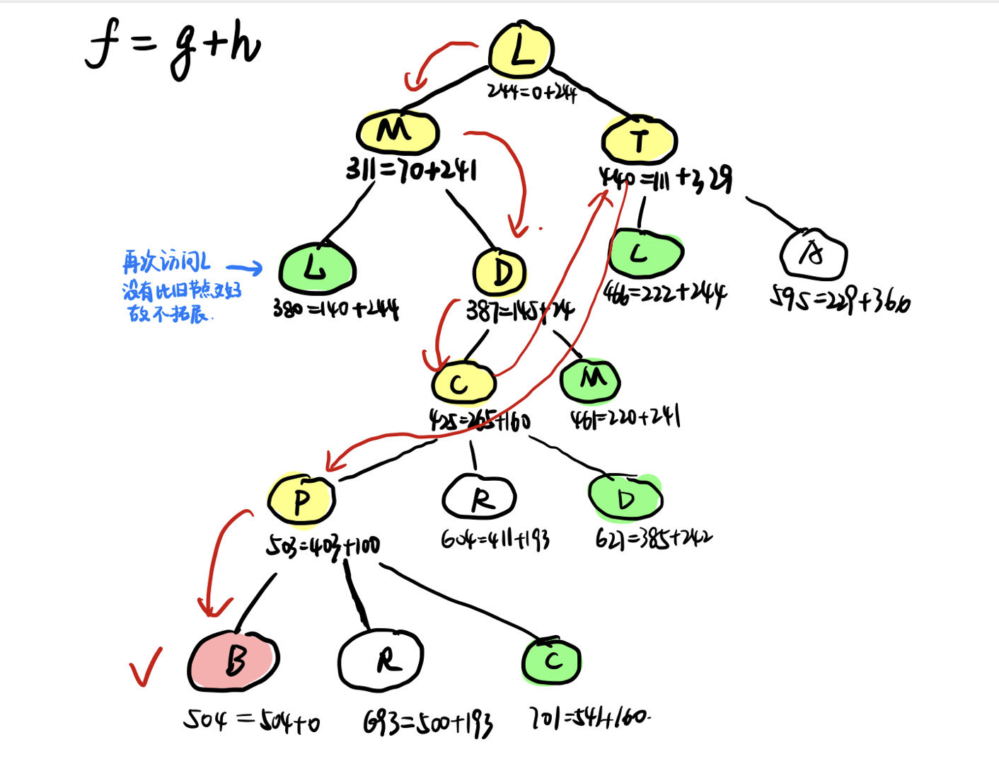
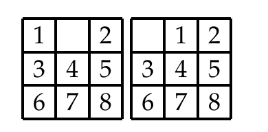
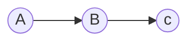

# Homework2

> PB20020480 王润泽

**4.1** 跟踪 $A^*$ 搜索算法用直线距离启发式求解从Lugoj到Bucharest问题的过程。按顺序列出算法扩展的节点和每个节点的 $f,g,h$ 值。

**A:** 在 Romania问题中，各个点到 Bucharest 的直线距离如下，以该距离作为启发式函数 $h(n)$。

 

同理从Lugoj出发，可以定义Lugoj走到n距离为耗散函数 $g(n)$，那么可以得到下图

**注:** 该构建路径时，使用了 **Practical Version** 的算法，所以当出现重复结点时不一定会拓展。

****

**4.2** 启发式路径算法是一个最佳优先搜索，它的目标函数是 $f(n)=(2-w)g(n)+wh(n)$ 。算法中 $w$ 取什么值能保证算法是最优的?当时  $w=0$，这个算法是什么搜索? $w=1$ 呢? $w=2$ 呢?

**A:** 当 $h$ 保持一致性时，即 $h(n)$不被高估时，算法是最优的。

改写 $f(n) = (2-w)[g(n)+\frac{w}{2-w}h(n)]$，系数 $(2-w)$不影响拓展，只要 $w<2$ 即可，$\frac{w}{2-w}h(n)$ 不会被高估，则要
$$
\frac{w}{2-w}h(n)\le h(n)
$$
即有 $ \frac{2w-2}{2-w}\le0 $ 所以有 $w\le 1$，且由于保证启发式函数非负性，$w\ge0$
$$
0\le w\le 1
$$
​	当 $w=0$ 时，这个带系数的一致代价搜索；当 $w=1$ 时，这是 $A^*$ 搜索；当 $w=2$ 时，这是带系数的 Greedy Search

****

**4.3** 设计一个启发函数，它在八数码问题中有时会估计过高，并指出对某一特定问题它会求出
次优解（可以用计算机编程找出）。证明：如果 $h$ 被高估的部分不超过 c，$A^∗$ 算法返回的解代
价比最优解代价多出的部分也不超过 c。

**A:**  比如可以设计 $h=h_1+h_2$，$h_1$为错位棋子数，$h_2$ 为所有棋子到其目标位置的曼哈顿距离和

例如

左图为一个估计过高的例子，它比右图目标图相比，启发式函数为 $h=2$,高于实际代价 $h^*=1$

**proof：** 设实际代价为 $h^*(x)$，由条件知 $h(x)\le h^*(x)+c$；次优解为 $G'$,而最优目标结点是 $G$。

反证：假设 $A^∗$ 算法返回的解代价比最优解代价多出的部分超过 c，即 $g(G')-g(G)>c$;

由于 $h^*(G)=0$，故由条件可知 $h(G)\le h^*(G)+c=c$, 而 $G'$ 是在高估启发函数下得到的次优解，有 $h(G')=0$;

那么对目标函数 $f(G')-f(G)=g(G')-g(G)+h(G')-h(G)>0$，这将会导致在高估启发式函数的情况下优先选择 $G$ 而不是 $G'$，这与 $G'$为在高估启发函数下得到的次优解相矛盾。

故所以返回的解与最优解之间的耗散差不会超过𝑐.

****

**4.7** 证明如果启发式是一致的，它一定是可采纳的。构造一个非一致的可采纳启发式。

**A:** 启发式是一致的说明，每个结点 $n$，在行动 $a$ 后产生的后继结点 $n'$ 中满足
$$
h(n)\le c(n,a,n')+h(n')
$$
其中 $c(n,a,n')$为从 $n$ 到 $n'$ 的代价，非负。

假设起始点为 $n$, 而目标点为 $n^*$,对于一条从 $n$ 到 $n^*$ 的最短路径有
$$
h(n)-h(n_1)\le c(n,a_1,n_1)\\
h(n_1)-h(n_2)\le c(n_1,a_2,n_2)\\
...\\
h(n_{N-1})-h(n^*)\le c(a_{N-1},a_{N},n^*)
$$
累加后得 $h(n)-h(n^*)\le \sum_i c_i=h^*(n)$，而 $h(n^*)=0$,故可以得到 $h(n)$ 是可采纳的，即不超过实际代价 $h^*$

**非一致性的可采纳的启发式函数**

其中 $c(A,B)=2,c(B,C)=2$。假设 $h(A)=4，h(B)=1,h(C)=0$, 即启发式函数没有高估，是可采纳的。而此时对于 $A$ 来说 $h(A)>h(B)+c(A,B)$，是非一致的

