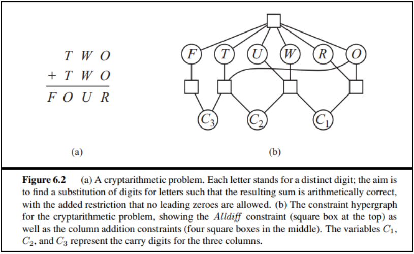
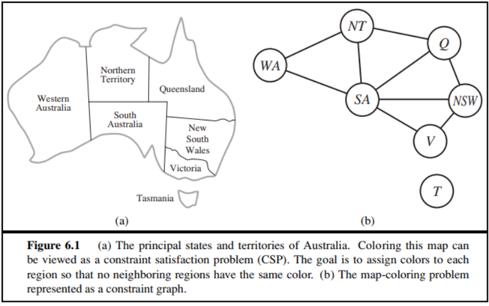

# Homework3

> PB20020480 王润泽

**6.5** 分别用带有前向检验、MRV和最少约束值启发式的回溯算法手工求解**图6.2**中的密码算数问题

**A：** 密码算数问题约束条件如下

1. $O+O=R+10C_1$
2. $C_1+W+W=U+10C_2$
3. $C_2+T+T=O+10C_3$
4. $C_3=F,T\ne0,F\ne0$
5. 不同的字母 $F,T,U,W,R,O$ 数字各不相同

变量有：$F,T,U,W,R,O\in\{0,1,2...,9\}$, $C_1,C_2,C_3\in\{0,1\}$

采取MRV方法

|         | $C_3$   | $C_2$     | $C_1$     | $F$     | $T$       | $W$       | $O$         | $U$       | $R$      |
| ------- | ------- | --------- | --------- | ------- | --------- | --------- | ----------- | --------- | -------- |
| $Init$  | **{1}** | {0,1}     | {0,1}     | {1}     | {1,..,9}  | {0,..,9}  | {0,..,9}    | {0,..,9}  | {0,..,9} |
| $C_3=1$ | 1       | {0,1}     | {0,1}     | **{1}** | {5,...,9} | {0,..,9}  | {0,..,9}    | {0,..,9}  | {0,..,9} |
| $F=1$   | 1       | **{0,1}** | {0,1}     | 1       | {5,...,9} | {0,..,9}  | {0,..,9}    | {0,..,9}  | {0,..,9} |
| $C_2=0$ | 1       | 0         | **{0,1}** | 1       | {5,...,9} | {0,..,4}  | {0,2,4,6,8} | {0,..,9}  | {0,..,9} |
| $C_1=0$ | 1       | 0         | 0         | 1       | {5,6,7}   | {0,2,3,4} | **{0,2,4}** | {0,4,6,8} | {0,4,8}  |
| $O=4$   | 1       | 0         | 0         | 1       | {7}       | {0,2,3,4} | 4           | {0,4,6,8} | **{8}**  |
| $R=8$   | 1       | 0         | 0         | 1       | **{7}**   | {0,3}     | 4           | {0,6}     | 8        |
| $T=7$   | 1       | 0         | 0         | 1       | 7         | **{0,3}** | 4           | {0,6}     | 8        |
| $W=0$   | 1       | 0         | 0         | 1       | 7         | 3         | 4           | **{6}**   | 8        |
| **U=6** | 1       | 0         | 0         | 1       | 7         | 3         | 4           | 6         | 8        |

****

**6.11** 用 AC-3 算法说明弧相容对图中问题能够检测出部分赋值{WA = red, V = blue}的不相容

**A：** 初始队列 {SA,WA},{SA,V},{NT,SA},{SA,NT}{Q,SA}{SA,Q}...........

|                         | SA    | WA   | NT    | Q     | NSW   | V    |
| ----------------------- | ----- | ---- | ----- | ----- | ----- | ---- |
| $Init$                  | {RGB} | {R}  | {RGB} | {RGB} | {RGB} | {B}  |
| {SA,WA}                 | {GB}  | {R}  | {RGB} | {RGB} | {RGB} | {B}  |
| {SA,V}                  | {G}   | {R}  | {RGB} | {RGB} | {RGB} | {B}  |
| {NT,SA},{Q,SA},{NSW,SA} | {G}   | {R}  | {RB}  | {RB}  | {RB}  | {B}  |
| {NT,WA}                 | {G}   | {R}  | {B}   | {RB}  | {RB}  | {B}  |
| {NSW,V}                 | {G}   | {R}  | {B}   | {RB}  | {R}   | {B}  |
| {Q,NT}                  | {G}   | {R}  | {B}   | {R}   | {R}   | {B}  |
| {Q,NSW}                 | {G}   | {R}  | {B}   | {}    | {R}   | {B}  |

此时 $Q$ 出现空集，则检查出 ${WA=red,V=blue}$ 不相容

**6.12**	 用**AC-3**算法求解树结构**CSP**在最坏情况下的复杂度是多少?

**A:** 

假设有n个顶点，每个顶点可以有D个取值，那么每次检查一条弧 $(X_i,X_j)$中 $X_i$ 是否要修改其值域时，时间复杂度最坏为 $O(D^2)$ ；

在树状结构的情况下，弧的数目为 $O(n)$，而在树状结构中采用逆拓扑排序检验和集合存储的方式可以使得每条弧只会被检查 $O(1)$次

所以，最坏复杂度为 $O(nD^2)$
