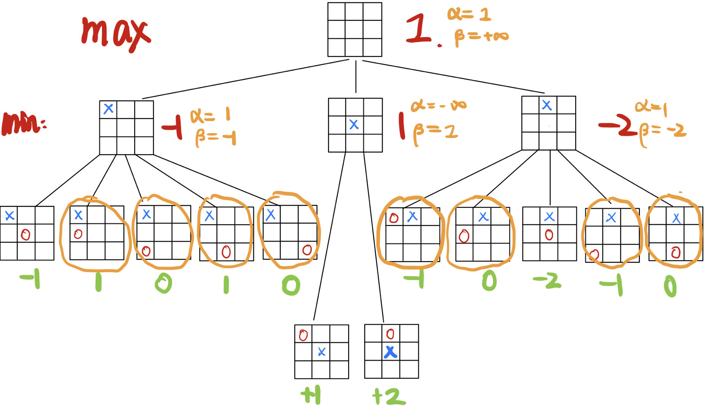
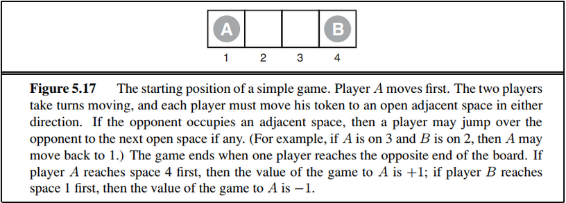
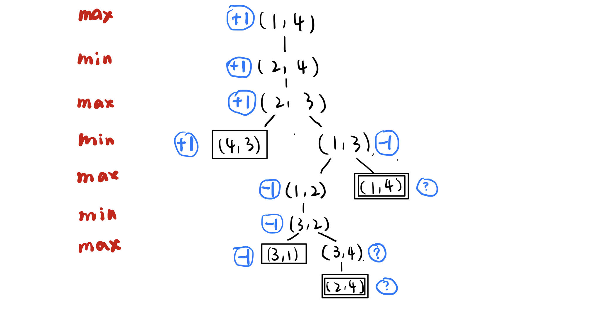
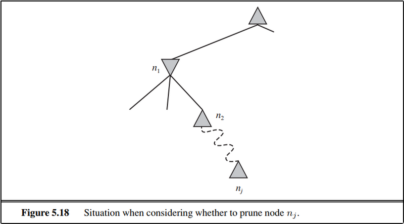

# Homework4

> PB20020480 王润泽

**5.9** 本题以井字棋（圈与十字游戏）为例练习博弈中的基本概念。定义 $X_n$ 为恰好有 $n$ 个 $X$ 而没有 $O$ 的行、列或者对角线的数目。同样 $O_n$ 为正好有个 $n$ 的 $O$ 行、列或者对角线的数目。效用函数给 $X_3=1$ 的棋局 $+1$ ，给 $O_3=1$ 的棋局 $-1$ 。所有其他终止状态效用值为 0 。对于非终止状态，使用线性的评估函数定义为 $Eval(s) =3X_2(s)+X_1(s)-(3O_2(s)+O_1(s))$ 。

1. **估算可能的井字棋局数**

   **A：** 九个格子双方轮流下棋，至少要两个回合后（5次）先手才能决出胜负，对应的有7种赢法，对于输方则有 $C_6^2$ 种选择可能，故在第5轮决出胜负时，有 $6*C_6^2=120$ 种。

   若在第6轮决出胜负，则属于后手赢。如果是赢家对角线，那么输方有 $C^3_6$种可能；如果是赢家是行、列赢，则输方有 $C_6^3-2$种。故在第6轮决出胜负时，有 $148$ 种

   以此类推第七轮决出胜负时有 $444$ 种，第八轮有 $96$种，第九轮有$118$ 种

   以上可能的局数有 $926$ 种，估算大概是 $900$ 种左右（未考虑对称性）

2. **考虑对称性，给出从空棋盘开始的深度为2 的完整博弈树（即，在棋盘上一个X一个O的棋局）。**

   **A:** 博弈树如下：（永远 $X$ 先手）

   

3. **标出深度为2的棋局的评估函数值。**

   如上图绿字

4. **使用极小极大算法标出深度为1和0的棋局的倒推值,并根据这些值选出最佳的起始行棋。**

   如上图红字，最佳落子为中央处

5. **假设结点按对 $\alpha-\beta $ 剪枝的最优顺序生成，圈出使用 $\alpha-\beta $ 剪枝将被剪掉的深度为2的结点。**

​		由于是按照最优顺序生成，所以第一层首先搜索的是中央处，第二层都优先搜索到最小的结点。如上图橙色圈出。

****

**5.8** 考虑**图5.17**中描述的两人游戏。

1. **根据如下约定画出完整博弈树:**
   - 每个状态用 $(s_A,s_B)$ 表示，其中 $s_A$ 和 $s_B$ 表示棋子的位置
   - 每个终止状态用方框画出，用圆圈写出它的博弈值。
   - 把循环状态（在到根结点的路径上已经出现过的状态）画上双层方框。由于不清楚他们的值，在圆圈里标记一个“? ”

2.  **给出每个结点倒推的极小极大值（也标记在圆圈里)。解释怎样处理“?”值和为什么这么处理。**

	如上图所示， **？** 值一定是 $\{-1,1\}$ 中的某个值，故采取如下策略：
$$
\text{MAX}:\max\{-1,?\}=?,\max\{+1,?\}=+1,\max\{?,?\}=?\\
\text{MIN}:\min\{-1,?\}=-1,\min\{+1,?\}=?,\min\{?,?\}=?
$$
3. **解释标准的极小极大算法为什么在这棵博弈树中会失败，简要说明你将如何修正它，在**（b）**的图上画出你的答案。你修正后的算法对于所有包含循环的游戏都能给出最优决策吗?**

   因为在标准的极小极大值算法中采取的策略是深度优先搜索，所以遇到循环的状态会导致无线递归的情况。

   解决方法是，由于博弈的所有情况是可穷尽的，故在搜索过程中记录下过去访问过的历史结点，当新的结点出现重复时则进行标记为 **？**，并终止搜索。

   该方法不能对所有循环的游戏保证都给出最优结果，如果当所有叶子结点只有 **？**，那么会造成最终的结果为 **？** 的不定状态，给不出最优结果。

4. **这个4-方格游戏可以推广到n个方格，其中n>2。证明如果是n偶数，A一定能赢；而是n奇数，则A一定会输。**

   数学归纳法：
   
   当 $n=3$ 时，因为A先手，所以第一步为 $(2,3)$，则这会导致在第二步时B取胜 $(1,2)$
   
   当 $n=4$ 时，由上面的博弈图可以看出 A 取胜
   
   假设 $n=2m$ 时，A取胜。
   
   那么，当 $n=2m+2$时，由游戏规则必然会由于双方在一个来回中的移动后，使得问题归约到 $n-2=2m$ 的问题，此时 A 取胜。同理 $n=2m+1$ 为奇数时 $A$ 一定会输

****

**5.13** 请给出 $\alpha-\beta$ 剪枝正确性的形式化证明。要做到这一点需考虑**图5.18**。问题为是否要剪掉结点  $n_j$ ,它是一个**MAX**结点，是 $n_1$ 的一个后代。基本的思路是当且仅当 $n_1$ 的极小极大值可以被证明独立于 $n_j$ 的值时，会发生剪枝.

1. **$n_1$ 的值是所有后代结点的最小值:  $n_1=\min(n_2,n_{21},...,n_{2b_2})$ 。请为 $n_2$ 找到类似的表达式，以得到用 $n_j$ 表示的 $n_1$ 的表达式。**
   $$
   n_2=\max(n_3,n_{31},\cdots,n_{3b_3})\\
   \cdots\\
   n_{j-1}=\min(n_j,n_{j1},\cdots,n_{jb_j})
   $$
   嵌套循环，可得到 $n_1=\min(\max(\cdots\min(n_j,n_{j1},\cdots,n_{jb_j})),n_{21},...,n_{2b_2})$

2. **深度为 $i$ 的结点 $n_i$ 的极小极大值已知，$l_i$ 是在结点 $n_i$ 左侧结点的极小值（或者极大值)。同样， $r_i$ 是在 $n_i$ 右侧的未探索过的结点的极小值(或者极大值)。用 $l_i$ 和 $r_i$ 的值重写 $n_1$ 的表达式**

  由题意可知，对任意层都已知左侧结点而未知右侧，即采取深度优先搜索的方式，那么有
  $$
  \begin{aligned}
   n_1&=\min(l_2,n_2,r_2)=\min(l_2,\max(l_3,n_3,r_3),r_2)\\
   &=\cdots=\min(l_2,\max(l_3,\min(\cdots\min(l_j,n_j,r_j),r_3)r_2)
   \end{aligned}
  $$

3. **现在重新形式化表达式，来说明为了向 $n_1$ 施加影响， $n_j$ 不能超出由 $l_i$  值得到的某特定界限。**

   由于 $n_j$ 是一个 **MAX** 结点，故为了向 $n_1$ 施加影响，得在每次 $\min-\max$过程中被选出，而由于 $n_1$ 是一个 **MIN** 结点，所以 $j$ 是偶数，下面证明 $n_j$ 的界限范围:

   - 在 $j-1$ 层，为了对 $n_1$ 产生影响，所以必须在此层中 $n_j=\min(l_j,n_j,r_j)=n_j$,由于 $r_i$ 未知，所以至少要保证 $n_j\le l_j$
   - 在 $j-2$ 层，同理得 $n_{j-2}=\max(l_{j-1},n_{j-1},r_{j-1})=\max(l_{j-1},n_j,r_{j-1})$，至少有 $n_j\ge l_{j-1}$
   - 以此类推，得到 $\max(l_3,l_5\cdots,l_{j-1})\le n_j\le\min(l_2,l_4,\cdots,l_{j})$

   由于$j$ 为奇数时为 **MAX** 结点， $j$ 为偶数时是 **MIN** 结点，所以令 $\alpha$ 为 **MAX** 结点下界，$\beta$ 为 **MIN** 结点上界。得到 $\alpha \le n_j \le\beta$ 时，$n_j$ 会对 $n_1$ 产生影响的必要条件；反之，当 $\alpha \ge \beta$ 时，则 $n_j$ 一定不会对 $n_1$ 产生影响。

4. **假设 $n_j$ 是MIN结点的情况，请重复上面的过程**

   - $n_j$ 是 **MIN** 结点，$j$ 为奇数
   - $n_{j-1}=\max(l_j,n_j,r_j)$，至少有 $n_j\ge l_{j}$
   - $n_{j-2}=\min(l_{j-1},n_{j},r_{j-1})$，至少有 $n_j\le l_{j-1}$
   - 依次类推得到 $\max(l_3,l_5\cdots,l_{j})\le n_j\le\min(l_2,l_4,\cdots,l_{j-1})$

 