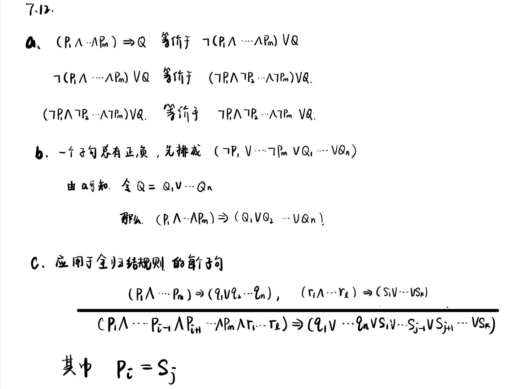

# Homework 5

#### 作业5.1

#### 作业5.2

**证明.**  证明前向链接算法的完备性。

**Proof:** 前向链接是完备的即每个被蕴涵的原子语句都可以推导得出。

考察 inferred 表的最终状态(在算法到达不动点以后，不会再出现新的推理)。该表把推导出的每个符号设为 true，而其他符号为 false。

假设相反的情况成立，即某个子句$a_1 \land \cdots \land a_k \Rightarrow b$在此模型下为假。那么$a_1 \land \cdots \land a_k$在模型中必须为真，$b$必须为假。但这与算法已到达一个不动点的假设矛盾。因此在不动点推导出的原子语句集定义了原始**KB**的一个模型。

更进一步，被**KB**蕴涵的任一原子语句$q$在它的所有模型中为真，尤其是这个模型。因此每个被蕴涵的语句$q$都可以被算法推导得出。