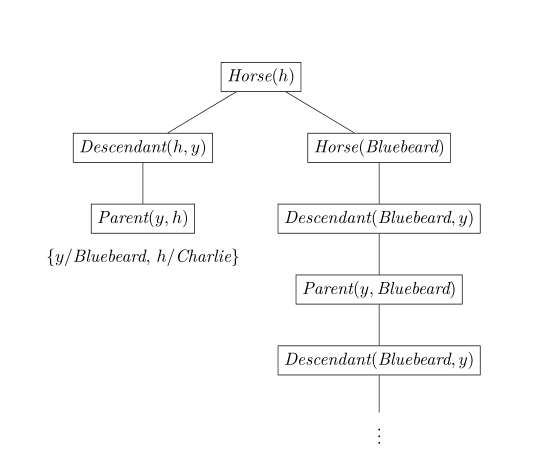

# Homework6

**8.24** 用一个相容的词汇表（需要你自己定义）在一阶逻辑中表示下列语句：

- 某些学生在2001年春季学期上法语课
- 上法语课的每个学生都通过了考试
- 只有一个学生在2001年春季学期上希腊语课
- 希腊语课的最好成绩总是比法语课的最好成绩高
- 每个买保险的人都是聪明的
- 没有人会买昂贵的保险
- 有一个代理，他只卖保险给那些没有投保的人
- 镇上有一个理发师，他给所有不自己刮胡子的人刮胡子
- 在英国出生的人，如果其双亲都是英国公民或永久居住者，那么此人生来就是一个英国公民
- 在英国以外的地方出生的人，如果其双亲生来就是英国公民，那么此人血统上是一个英国公民
- 政治家可以一直愚弄某些人，也可以在某个时候愚弄所有人，但是他们无法一直愚弄所有的人

****

设计如下的词汇表：

- $\textit{Student}(x)$表示$x$是学生
- $\textit{Select}(x, c, s)$表示学生$x$在$s$学期上$c$课
- $\textit{Pass}(x, c, s)$表示在$s$学期上$c$课的学生$x$通过了考试
- $\textit{Grade}(x, c, s)$表示在$s$学期上$c$课的学生$x$的成绩
- $\textit{Person}(x)$表示$x$是正常人
- $\textit{Smart}(x)$表示$x$是聪明的
- $\textit{Policy}(x)$表示$x$是保险
- $\textit{Expensive}(x)$表示$x$是昂贵的
- $\textit{Agent}(x)$表示$x$是代理
- $\textit{Insured}(x)$表示$x$已被投保
- $\textit{Buy}(x, y, g)$表示$x$向$y$购买了$g$
- $\textit{Sell}(x, y, g)$表示$x$把$g$卖给了$y$
- $\textit{Barber}(x)$表示$x$是理发师
- $\textit{Shave}(x, y)$表示$x$给$y$刮胡子
- $\textit{Born}(x, c)$表示$x$在国家$c$出生
- $\textit{Parent}(x, y)$表示$x$是$y$的双亲之一
- $\textit{Citizen}(x, c, b)$表示$x$基于$b$是国家$c$的公民
- $\textit{Resident}(x, c)$表示$x$是国家$c$的永久居住者
- $\textit{Politician}(x)$表示$x$是政治家
- $\textit{Fool}(x, y, t)$表示$x$在$t$时刻愚弄了$y$

给出上述语句的表示

- $\exists x \quad \textit{Student}(x) \land \textit{Select}(x, \textit{French}, \textit{2001Spring})$
- $\forall x,s \quad \textit{Student}(x) \land \textit{Select}(x, \textit{French}, s) \Rightarrow \textit{Pass}(x, \textit{French}, s)$
- $\exist x \quad \textit{Student}(x) \land \textit{Select}(x, \textit{Greek}, s) \land \big(\forall y \quad y \neq x \Rightarrow \lnot \textit{Select}(y, \textit{Greek}, \textit{2001Spring})\big)$
- $\forall s\ \exists x\ \forall y \quad \textit{Grade}(x, \textit{Greek}, s) > \textit{Grade}(y, French, s)$
- $\forall x \quad \textit{Person}(x) \land(\exist a,p\quad \textit{Policy}(p) \land \textit{Agent}(a) \land \textit{Buy}(x, a, p)) \Rightarrow \textit{Smart}(x)$
- $\forall x,p,a \quad \textit{Person}(x) \land \textit{Policy}(p) \land \textit{Expensive}(p) \Rightarrow \lnot \textit{Buy}(x, a, p)$
- $\exists a \quad \textit{Agent}(a) \land \Big(\forall x, p \ \big(\textit{Policy}(p) \land \textit{Sell}(a, x, p)\big) \Rightarrow \big(\textit{Person}(x) \land \lnot \textit{Insured}(x)\big)\Big)$
- $\exists x \quad \textit{Barber}(x) \land \big(\forall y \ \textit{Person}(y) \land \lnot \textit{Shave}(y,y) \Rightarrow \textit{Shave}(x,y)\big)$
- $\forall x \quad \textit{Person}(x) \land \textit{Born}(x, \textit{UK}) \land \bigg(\forall y \ \textit{Parent}(y,x) \land \Big(\big(\exists b \ \textit{Citizen}(y, \textit{UK}, b)\big) \lor \textit{Resident}(y, \textit{UK})\Big)\bigg)$$ \Rightarrow \textit{Citizen}(x, \textit{UK}, \textit{"Birth"})$
- $\forall x \quad \textit{Person}(x) \land \lnot \textit{Born}(x, \textit{UK}) \land \Big(\forall y \ \textit{Parent}(y,x) \land \big(\exists b \ \textit{Citizen}(y, \textit{UK}, b)\big)\Big) \Rightarrow \textit{Citizen}(x, \textit{UK}, \textit{"Descent"})$
- $\forall x \quad \textit{Politician}(x) \Rightarrow \big(\exists y \  \forall t \ \textit{Person}(y) \land \textit{Fool}(x, y, t)\big) \land \big(\exists t \ \forall y \ \textit{Person}(y) \land \textit{Fool}(x, y, t)\big) \land $$\lnot\big(\forall t \ \forall y \ \textit{Person}(y) \land \textit{Fool}(x, y, t)\big)$

****

**8.17**

解释下面给出的 Wumpus 世界中相邻方格的定义存在什么问题：
$$
\forall x, y \quad \textit{Adjacent}([x, y], [x + 1, y]) \land \textit{Adjacent}([x, y], [x, y + 1])
$$
**Answer:** 

这样的定义仅考虑了坐标轴正方向上的相邻，但实际上相邻关系是无向的（即对称的）；另外定义没有考虑到世界边界的作用关系，可能会给出在实际问题中不存在的相邻关系。

一个更合理的定义是
$$
\begin{aligned}
         & \forall 1 \leqslant x < 4, 1 \leqslant y < 4 \\ & \textit{Adjacent}([x, y], [x + 1, y]) \land \textit{Adjacent}([x + 1, y], [x, y]) \\ \land &\textit{Adjacent}([x, y], [x, y + 1]) \land \textit{Adjacent}([x, y + 1], [x, y])
    \end{aligned}
$$

****

**9.3**

假定知识库中只包括一条语句：$\exists x\ \textit{AsHighAs}(x,\, \textit{Everest})$，下列哪个语句是应用存在量词实例化以后的合法结果？

1. $\textit{AsHighAs}(\textit{Everest},\, \textit{Everest})$
2. $\textit{AsHighAs}(\textit{Kilimanjaro},\, \textit{Everest})$
3.  $\textit{AsHighAs}(\textit{Kilimanjaro},\, \textit{Everest}) \land \textit{AsHighAs}(\textit{BenNevis},\, \textit{Everest})$

**Answer:**

语句1不合法，替换变元的应当是从未在知识库中出现过的常量符号，而不是已经出现过的$\textit{Everest}$

语句2是合法

语句3不合法，使用了两次实例化，而 $\exist$ 只要一个

****

**9.4**

对于下列每对原子语句，如果存在，请给出最一般合一置换：

1. $P(A,\, B,\, B),\ P(x,\, y,\, z)$
2. $Q(y,\, G(A,\, B)),\ Q(G(x,\, x),\, y)$
3. $\textit{Older}(\textit{Father}(y),\, y),\ \textit{Older}(\textit{Father}(x),\, \textit{John})$
4. $\textit{Knows}(\textit{Father}(y),\, y),\ \textit{Knows}(x,\, x)$

**Answer**

1.  $\{A/x,\, B/y,\, B/z\}$
2. 合一失败，如果 $y=G(A,B),y=G(x,x)$ 那么$x$取$A$和$B$，矛盾。两个语句对不同对象使用相同变量名则不能合一，要通过重命名解决
3.  $\{y/\textit{John},\, x/\textit{John}\}$
4. 合一失败，发生检验中$y$和$\textit{Father}(y)$无法合一

****

**9.6**

写出下列语句的逻辑表示，使得它们适用一般化假言推理规则：

- 马、奶牛和猪都是哺乳动物。
- 一匹马的后代是马。
- Bluebeard 是一匹马。
- Bluebeard 是 Charlie 的家长。
- 后代和家长是逆关系。
- 每个哺乳动物都有一个家长。

**Answer**

定义

- `Horse(x)` 表示 `x` 是马。
- `Cow(x)` 表示 `x` 是奶牛。
- `Pig(x)` 表示 `x` 是猪。
- `Mammal(x)` 表示 `x` 是哺乳动物。
- `Descendant(x,y)` 表示 `x` 是 `y` 的后代。
- `Parent(x,y)` 表示 `x` 是 `y` 的家长。

逻辑表示

- Horse(x) $\Rightarrow$ Mammal(x) 

  Cow(x) $\Rightarrow$ Mammal(x) 

  Pig(x) $\Rightarrow$ Mammal(x)

- Descendant(x, y) $\land$ Horse(y) $\Rightarrow$ Horse(x)

- Horse(Bluebeard)

- Parent(Bluebeard, Charlie)

- Descendant(x, y) $\Rightarrow$ Parent(y, x) Parent(x, y) $\Rightarrow$ Descendant(y, x)

- Mammal(x) $\Rightarrow$ Parent(Gen(x), x)，其中Gen(x)是一个Skolem范式

****

**9.13**

用到你在习题9.6中写出的语句，运用反向链接算法来回答问题

**a. 画出用穷举反向链接算法为查询$\exists h\ \textit{horse}(h)$生成的证明树，其中子句按照给定的顺序进行匹配**

如图所示，会有无限递归的现象

**b. 对于本邻域，你注意到了什么？**

注意到树中出现的无限延伸，这实际上是由于规则子句的顺序引起的，可以通过在规则$\textit{Descendant}(x, y) \land \textit{Horse}(y) \Rightarrow \textit{Horse}(x)$之前指定匹配顺序来得到解，但是如果要求穷举所有的解，那与子句顺序无关，循环一定会发生。

**c. 实际上从你的语句中得出了多少个$h$的解？**

实际上得到了$\textit{Bluebeard}$和$\textit{Charlie}$两个解。
