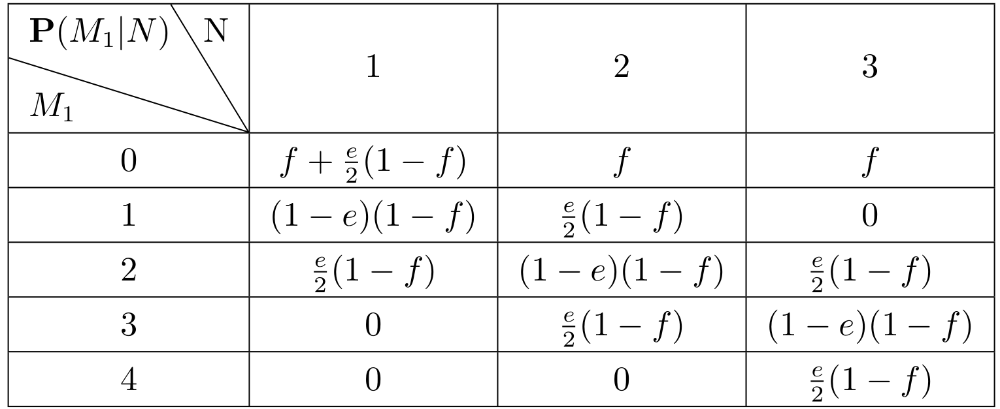

# Homework7

> PB20020480 王润泽

#### Q1

两个来自世界上不同地方的宇航员同时用他们自己的望远镜观测了太空中某个小区域内恒星的数目 N。他们的测量结果分别为 M1 和 M2。通常，测量中会有不超过 1 颗恒星的误差，发生错误的概率 e 很小。每台望远镜可能出现（出现的概率 f 更小一些）对焦不准确的情况（分别记作 F1 和F2），在这种情况下科学家会少数三颗甚至更多的恒星（或者说，当 N 小于3 时，连一颗恒星都观测不到）。考虑图1所示的三种贝叶斯网络结构。

##### a.这三种网络结构哪些是对上述信息的正确（但不一定高效）表示

答：上面的 （ii）和（iii）是对信息的正确表达。

(ii) 对因果结构的表示是正确的，两台望远镜的对焦情况彼此独立，测量结果受实际恒星数量和对焦情况的影响；(iii) 也是正确的，其是对结点排序之后的结果

##### b.哪一种网络结构是最好的？请解释。

(ii) 比 (iii) 需要更少的参数，因此网络 (ii) 是最好的。

##### c. 当$N \in \{1,\, 2,\, 3\}$，$M_1 \in \{0,\, 1,\, 2,\, 3,\, 4\}$时，请写出$\mathbf{P}(M_1 | N)$的条件概率表。概率分布表里的每个条目都应该表达为参数$e$和或$f$的一个函数。

通过网络（ii）图可得：
$$
\begin{aligned}
P(M_1|N) &= \sum_{F_1}P(M_1,F,N)/P(N)\\
&=\sum_{F_1}P(M_1|F_1,N)P(F_1)P(N)/P(N)\\
&=\sum_{F_1}P(M1|F_1,N)P(F_1)\\
&=P(M_1|N,F_1)f+P(M_1|N,\lnot F)(1-f)
\end{aligned}
$$
由于测量结果 M1 通常在测量中会有不超过 1 颗恒星的误差，该误差记作 $e$, 那么不妨假，当N大于0时，M1多数一颗概率为 $e/2$，少数一颗概率为 $e/2$，数对的概率为 $1-e$，其他情况概率为0.

对测量结果少数3颗星的情况的概率为 $f$（如果$N\le3$,则认为M=0的概率为 $f$）

于是有下表

##### d.假设 $M_1=1$ ，$M_2=3$。如果我们假设 $N$ 取值上没有先验概率约束,可能的恒星数目是多少？

可能的恒星数为 2，4

##### e. 在这些观测结果下，最可能的恒星数目是多少？解释如何计算这个数目，或者，如果不可能计算，请解释还需要什么附加信息以及它将如何影响结果。

可以推导出 

当 $N=2$时，属于是 $F_1=false,F_2=false,M_1=true,M_2=true$
$$
P(N=2|M_1=1,M_2=3)=\frac{P(N=2)}{P(M_1=1,M_2=3)}(1-f)^2e^2/4
$$
当 $N=4$时，属于是 $F_1=true,F_2 = false,M_2=true$
$$
P(N=4|M_1=1,M_2=3)=\frac{P(N=4)}{P(M_1=1,M_2=3)}(1-f)f\frac{e}2
$$
无法计算，还需要知道$P(N)$，$P(M_1,M_2)$的概率分布才能得到结果。但总体来看，由于 $e,f$都是很小的概率，且 $f<e/2$，故可以大致判断 $N=4$的概率更大

****

#### Q2

考虑图14.22(ii)的网络，假设两个望远镜完全相同。$N \in \{1,\, 2,\, 3\}$，$M_1,\, M_2 \in \{0,\, 1,\, 2,\, 3,\, 4\}$，CPT 表和习题14.12所描述的一样。使用枚举算法（图14.9）计算概率分布$\mathbf{P}(N | M_1 = 2,\, M_2 = 2)$。

**答：** 同理有
$$
\begin{aligned}
P(N|M_1=2,M_2=2)
=&P(N,M_1=2,M_2=2)/P(M_1=2,M_2=2)\\
=&\sum_{F_1,F_2}P(N,F_1,F_2,M_1=2,M_2=2)/P(M_1=2,M_2=2)\\
=&\sum_{F_1,F_2}P(M_1=2|F_1,N)P(M_2=2|F_2,N)P(F_1)P(F_2)P(N)/P(M_1=2,M_2=2)\\
=&\alpha P(N)\{(1-f)^2P(M_1=2|\lnot F_1,N)P(M_2=2|\lnot F_2,N)\\
&+(1-f)f\left[P(M_1=2|\lnot F_1,N)P(M_2=2|F_2,N)+P(M_1=2|F_1,N)P(M_2=2|\lnot F_2,N)\right]\\
&+f^2P(M_1=2|F_1,N)P(M_2=2|F_2,N)\}
\end{aligned}
$$
其中 $1/P(M_1=2,M_2=2)=\alpha$，考虑到 $N\in\{1,2,3\}$，当 $F=true$时， $P(M=2|F,N)=0$,所以上式中第2项和第3项为可以消去，得到
$$
P(N|M_1=2,M_2=2)=\alpha P(N)(1-f)^2P(M_1=2|\lnot F_1,N)P(M_2=2|\lnot F_2,N)
$$
枚举则有
$$
P(N=1|M_1=2,M_2=2)=\frac{P(N=1)(1-f)^2}{P(M_1=2,M_2=2)}\times \frac{e^2}{4}\\
P(N=2|M_1=2,M_2=2)=\frac{P(N=2)(1-f)^2}{P(M_1=2,M_2=2)}\times (1-e)^2\\
P(N=3|M_1=2,M_2=2)=\frac{P(N=3)(1-f)^2}{P(M_1=2,M_2=2)}\times \frac{e^2}{4}
$$
