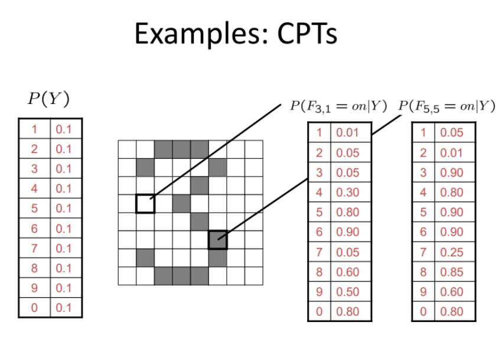
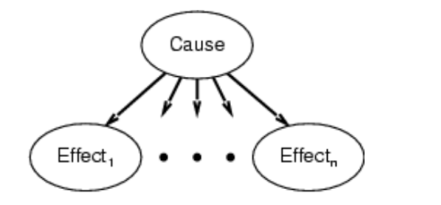
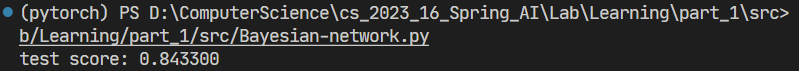
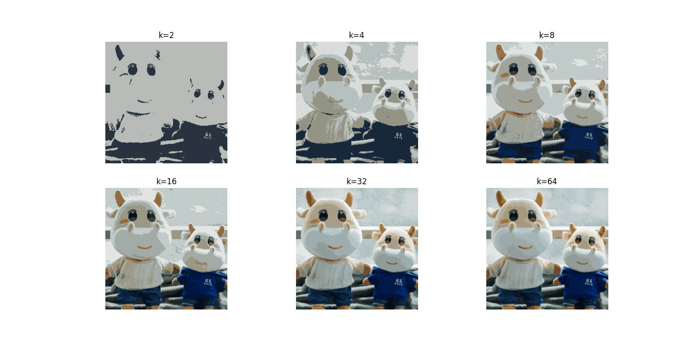
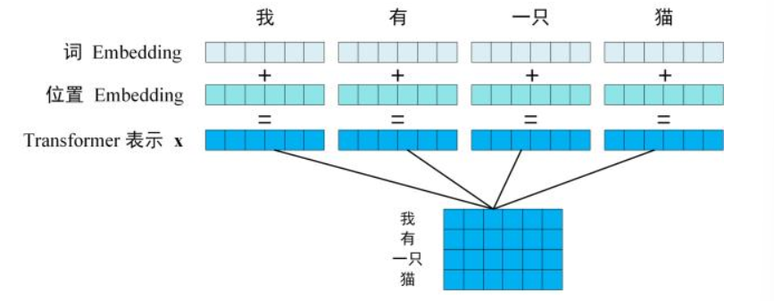
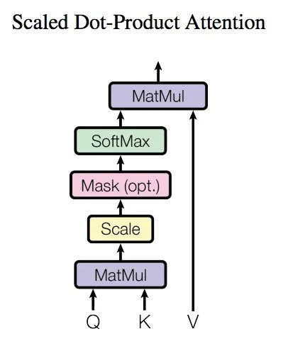
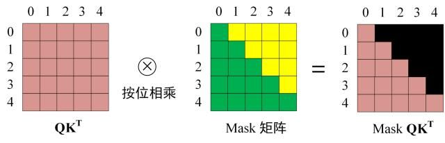
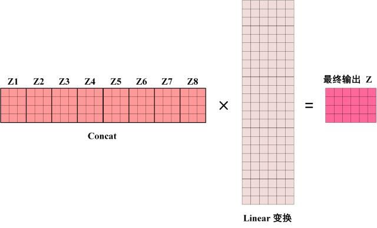
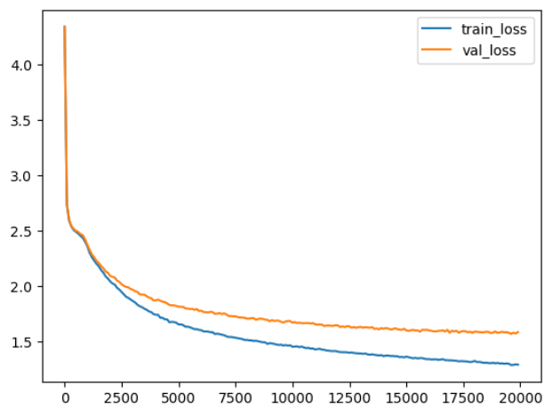
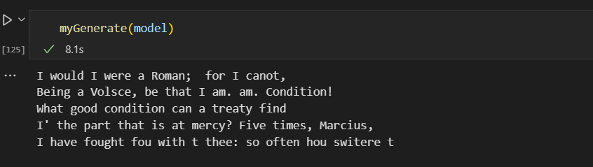

# 人工智能基础——实验Ⅱ报告

## 1 Bayesian Network

### 1.1 实验内容

如图，有一张显示手写的屏幕，屏幕上的像素有亮/暗(1/0)两种状态。当字迹覆盖某对应位置的像素时，该像素为亮的状态，否则为暗的状态。本次实验中，你需要使用包含各像素信息和最终数字结果的训练数据搭建一个贝叶斯网络，并根据测试数据的像素亮暗预测对应的数字，与测试数据的真实标签进行比较并计算准确率。



### 1.2 算法

根据贝叶斯网络，定义

- $X=(X_1,X_2,....,X_n)$ 为特征变量，在实验中共有 $784=28\times28$ 维，表示像素点位置状态为0/1
- $Y$ 为类别变量，在实验中用 $c\in\lbrace0,...,9\rbrace$ 的数字来表示类别

\在实验中假设了模型为**朴素贝叶斯网络**，每个特征与其他特征相互独立

<div align="center">
 	
</div>

那么全联合概率分布可以写成
$$
\begin{aligned}
P(X,Y)&=P(X_1,X_2,X_2,...,X_n,Y)\\

&=P(Y)P(X_1\vert Y)....P(X_n|Y)
\end{aligned}
$$
在我们根据训练后,可以先验概率和条件概率:
$$
P(Y=c_k)=\frac{\sum_i^mI(y^{(i)}=c_k)}{N}\quad c_k=0,1,..,9
$$

$$
P(X_j=a_{jl}|Y=c_k)=\frac{\sum_{i=1}^mI(x_j^{(i)}=a_{jl},y^{(j)}=c_k)}{\sum_i^mI(y^{(i)}=c_k)}\quad a_{jl}=0,1
$$
根据贝叶斯公式，对任意输入的特征变量（像素点） $x=(x_1,x_2,...,x_n)$，推断出结果
$$
\begin{aligned}
P(Y=c|X=x)&=\frac{P(X=x|Y=c)P(Y=c)}{P(X=x)}\\
&=\frac{P(Y=c)P(X_1=x_1\vert Y=c)....P(X_n=x_n|Y=c)}{P(X=x)}
\end{aligned}
$$
通过比较其中最大可能性的 $c$，推断出最后的结果, 由于分母都一致，所以可以只考虑分子：
$$
h_{nb}(x)=\arg\max_{c\in \lbrace0,...,9\rbrace} P(Y=c)\prod_{i=1}^n P(X_i=x|Y=c)
$$
通过上式即可得到最大概率的类别

### 1.3 代码

在具体代码实现时,进行一些优化手段

1. **Laplace** 修正: 为了防止一些特征信息在训练集中从未出现导致特征值被抹去,在估计概率值时要进行 *smoothing* 处理.具体来说是,假设 $N=10$ 表示训练集 $D$ 中可能的类别数, $N_i=2$ 表示每个像素特征可能的取值数,则对 (2) (3)式作出修正:
   $$
   \widehat P(c)=\frac{\vert D_c\vert +1}{\vert D_c\vert+N}
   $$

   $$
   \widehat P(x_i\vert c)=\frac{\vert D_{c,x_i}\vert +1}{\vert D_c\vert+N_i}
   $$

2. **对数概率**: 由于 (5) 式连乘会导致结果数值变小,为了避免数值精度问题,采取对数形式,即
   $$
   \widehat h_{nb}(x)=\arg\max_{c\in \lbrace0,...,9\rbrace} \log P(Y=c)+\sum_{i=1}^n \log P(X_i=x|Y=c)
   $$

3. **Numpy** 向量化: 由于在进行训练和测试时,有很多的计算可以利用 `Numpy` 的矩阵向量计算代替循环操作,大大提高了训练的速度

比如在 `fit` 函数用上了上面提到的优化:

```python
    def fit(self, pixels, labels):
        '''
        pixels: (n_samples, n_pixels, )
        labels: (n_samples, )
        '''
        n_samples = len(labels)
        # labal prior prob
        unique_labels, counts = np.unique(labels, return_counts=True)
        self.labels_prior[unique_labels] += counts
        self.labels_prior = (laplace_lambda + self.labels_prior) \
        					/ (n_samples + laplace_lambda * self.n_labels)
        # conditional prob
        for i in range(n_samples):
            pixel = pixels[i, :]
            label = labels[i]
            # Use advanced indexing to update the counts efficiently
            self.pixels_cond_label[np.arange(self.n_pixels), pixel, label] += 1
        for j in range(self.n_labels):
            n_pixel_samples = self.pixels_cond_label[:, :, j].sum(axis=1) \
            				+ self.n_values * laplace_lambda
            self.pixels_cond_label[:, :, j] = (self.pixels_cond_label[:, :, j] \
                                            + laplace_lambda) / n_pixel_samples[:, np.newaxis]
```

### 1.4 结果



具体结果如上所示,在测试集中,准确率达到了 **0.843** ,说明对大部分情况还是可以识别数字的

可以改进的地方是:如果能采用 **半朴素贝叶斯分类器** ,更加关注像素点之间的联系,那么对将能够提高训练的效果

## 2  K-means 

### 2.1 实验内容

实现K-Means算法，并使用K-Means算法来压缩一张图像。使用K-Means压缩图像的原理为，将图像上的每一个像素(R,G, B)视作一个数据点，并对所有点进行聚类。完成聚类之后，将所有数据点的值替换成其聚类中心的值，这样仅需保留几个聚类中心的数据点值以及其他
点的类别索引，从而达到压缩图片的目的。

本次实验中需要分别尝试 k=2,4,8,16,32 时的压缩结果.参考图片如下


### 2.2 算法

K-Means clustering 算法是经典的无监督学习算法,假设我们有 K 中类别
$$
(C(1),...C(i),....,C(K))
$$
我们要对数据集中的点 $D_{train}=\lbrace x_1,...,x_n\rbrace$ 进行类别划分, 在 K-Means 算法中,假设了每个类别由其中的中心点 $\mu_{C(i)}$ 所表达,那么该算法所要优化的目标则是
$$
Loss=\sum_{j=1}^{n}\vert\mu_{C(j)}-x_j\vert
$$
由于 $\mu$ 和每个 $x_j$ 所属的类别都是待优化的参数, 所以算法的步骤为

1. 随机选择初始化的 k 个样本作为初始聚类中心 $\mu = \mu_{(1)},....,\mu_{(K)}$, 在实验中采取了 **K-Mean++** 初始化方式,避免了初始化的像素值之间距离过近

2. 针对训练集每个样本 $x_i$ , 计算它到 K 个聚类中的距离,在本实验中采取计算**像素点 $RBG$ 的欧式距离**, 并将其分配到距离最小的聚类中心所对应的类中,即优化
   $$
   \min_{C(1),...C(K)}\sum_{j=1}^n \vert\mu_{C(j)}-x_j\vert
   $$

3.	针对每个类别 $C(j)$, 重新计算它的聚类中心 $\mu_{(j)}=\sum_{x\in C_{(j)}}x/\vert C(j) \vert$,即选择出每个类别新的代表像素值

4. 重复上面2,3步骤直到达到中止条件

### 2.3 结果



最终采取了从2到64个聚类的结果,在 $K=64$ 时,基本已经可以还原出原始图像,同时图像得到大大压缩


## 3 Deep Learning

Transformer 主要用于自然语言处理(NLP)与计算机视觉(CV)领域。它也是 GPT 等生成式模型采
用的架构。在本次实验中，将会实现一个简单的 Transformer.

### 3.1 实验内容

本次实验通过实现 transformer decoder 的架构，完成对莎士比亚文集的补全。实验的输入为 input.txt，其中是莎士比亚文集中的语句，需要模型根据这些语句根据 n-gram 作为语言模型进行自监督学习。n-gram 的具体形式如下:
$$
P(x_i\vert x_{i-1},...x(i-(n-1)))
$$
在 transformer decoder 中，模型会根据当前的输入去预测下一个词，之后，模型会将之前的输入与预测的词串联起来作为新的输入，去预测下下个词，这个过程不断迭代，直到预测得到的词为特殊的结束词 EOS（End-of-Sequence token）或者达到预测词数上限时终止预测（本实验中只需要给定预测词数上限即可）

### 3.2 Framework

经典的Transformer架构如下:


在本实验中,省去了 `Encoder Block`  和 `Decoder-encoder attention` 架构, 主要实现的是 `Decodeing Block` 内容

#### Embedding

在 Transformer 架构中，首先要获取输入句子的每一个单词的表示向量 **X**，**X**由单词的 Embedding 和单词位置的 Embedding 相加得到



其中词 Embedding可以有 pytorch 提供的方法来生成：

```python
self.wte = nn.Embedding(n_vocab, n_embd)
```

而位置 Embedding 则是根据三角函数来生成
$$
\left\{\begin{array}{l}
P E(\text { pos, } 2 i)=\sin \left(\text { pos } / 10000^{2 i / d_{\text {model }}}\right) \\
P E(\operatorname{pos}, 2 i+1)=\cos \left(\text { pos } / 10000^{2 i / d_{\text {model }}}\right)
\end{array}\right.
$$
其中，pos 表示单词在句子中的位置，d 表示 PE的维度 (与词 Embedding 一样)，2i 表示偶数的维度，2i+1 表示奇数维度 (即 2i≤d, 2i+1≤d)。

#### Self-Attention

Self-Attention 结构如下：



在实验中输入内容包括 Embedded 的向量 **X** 和 **Mask** 矩阵，而 $Q,K,V$ 则都是由 $X$ 通过一层 `linear layer` 得到，在经过 $QK^T$ 点积后，进行Mask操作



经过Mask的 $QK^T$ 对每行进行 **SoftMax** ,最后在与 $V$ 进行矩阵乘法即可获取输出 $Z$

```python
# Head: Self Attention
def forward(self, inputs):
    key = self.Key(inputs)
    query = self.Query(inputs)
    value = self.Value(inputs)
    scores = torch.matmul(query, key.transpose(-1, -2)) / (self.head_size ** 0.5)
    time_size = inputs.shape[1]
    tril = torch.tril(torch.ones(time_size, time_size, device=inputs.device))
    scores = scores * tril - 1e12 * (1 - tril)
    attn_weights = torch.softmax(scores, dim=-1)
    out = torch.matmul(attn_weights, value)
    return out
```

####  Multi-Head Attention

对于多注意力机制其实就是多个 Self-Attention的输出拼接而成，最后再进行一次 Linear Layer 变化即可



#### Feed Forward

Feed Forward 层比较简单，是一个两层的全连接层，第一层的激活函数为 Relu，第二层不使用激活函数，对应的公式如下
$$
\max{(0,XW_1+b_1)}W_2+b_2
$$

```python
class FeedForward(nn.Module):
    def __init__(self, n_embd):
        super().__init__()
        self.net = nn.Sequential(
            nn.Linear(n_embd, 4 * n_embd),
            nn.GELU(),
            nn.Linear(4 * n_embd, n_embd)
        )
    def forward(self, inputs):
        return self.net(inputs)
```

在代码实现中使用 `GELU` 作为 `Relu` 的替代

#### Add & Norm

Add & Norm 层由 Add 和 Norm 两部分组成，其计算公式如下：


在框架中实现也很简单，只要调用 torch中已有的方法即可

```python
def forward(self, x):
    x = self.attention(x) + x
    x = self.norm1(x)
    x = self.ff(x) + x
    x = self.norm2(x)
    return x
```

#### Transformer

最后的 `Transformer` 架构则是将上面的所有内容拼接起来即可，具体细节可见代码

### 3.3 实验结果

根据搭建的 Transformer架构,得到 train-loss 和 val-loss 的结果如下



在尝试输入一下文本

```python
def myGenerate(model):
    text = "I would I were a Roman; "
    context = torch.tensor(encode(text),device=device, dtype=torch.long)
    context = torch.stack([context])
    print(text,decode(model.generate(context, max_new_tokens=200)[0].tolist()))
```

输出结果如下



可能是由于迭代层数和训练结果不够多,导致输出文本仍有语句不通顺的地方,但整体来看输出结果已经很好了.

## 4 Summary

本次主要是关于人工智能 Learning部分的实验,实现了经典 Machine Learning算法: 贝叶斯网络与K-Means，以及Deep Learning 的 Transformer  架构,对现在主流的使用机器学习的框架有了更加深刻的了解,收获很多。