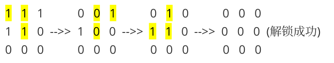
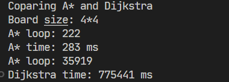

# Report

> AI Experiment1
>
> PB20020480 王润泽

## 1 A* Algorithm

### 1.1 Algorithm

A*（A-Star)算法是一种静态路网中求解最短路最有效的方法。

公式表示为：$f(n)=g(n)+h(n)$，其中$f(n)$是节点n从初始点到目标点的估价函数，$g(n)$是在状态空间中从初始节点到n节点的实际代价，$h(n)$是从n到目标节点最佳路径的估计代价。

当 $f(n)=g(n)$ 时，即只考虑走过的代价，那么算法退化为 **Dijkstra** 算法，可以找到最优的路径，但时间复杂度为 $O(V^2)$

当 $f(n)=h(n)$ 时，即只考虑距离目标的距离，那么算法退化为**最佳优先搜索（BFS）**算法，算法的速度可以达到最优，但不一定给出最佳的路径

启发式函数h(n)告诉A * 从任意结点n到目标结点的最小代价评估值。选择一个好的启发式函数是重要的。

> 如果h(n)经常都比从n移动到目标的实际代价小（或者相等），则A * 保证能找到一条最短路径。h(n)越小，A * 扩展的结点越多，运行就得越慢。
>
> 如果h(n)精确地等于从n移动到目标的代价，则A  star将会仅仅寻找最佳路径而不扩展别的任何结点，这会运行得非常快。
>
> 如果h(n)有时比从n移动到目标的实际代价高，则A star不能保证找到一条最短路径，但它运行得更快

### 1.2 Assignment

解决一个 $N\times N$ 二进制迷锁问题，每⼀个格点上只有0，1两种值，由于拨轮之间相互链接的关系，拨轮切换锁定的规则如下：

- 只能同时转动相邻呈“L”字形（四个⽅向的朝向均可）的三个拨轮，将它们同时由各⾃的锁定切换为⾮锁定状态，或从⾮锁定切换为锁定状态。

例如：



### 1.3 Experiment

#### 启发式函数的设计

基于以下的观察，当格点是孤立的时候

1. 棋盘有3个格点，需要耗费1步的代价：

0 ==1== 0          0 0 0
0 ==1== ==1==  -->> 0 0 0
0 0 0          0 0 0

2. 棋盘有2个格点，需要耗费2步的代价

0 1 ==0==          0 ==1== ==1== 	    0 0 0
0 ==1== ==0==  -->> 0 0 ==1== -->> 0 0 0
0 0 0          0 0 0		 0 0 0

3. 棋盘只有1个格点，需要耗费3步代价

0 ==0== 0 	    0 1 ==0==          0 ==1== ==1== 	    0 0 0
0 ==0== ==1== -->> 0 ==1== ==0==  -->> 0 0 ==1== -->> 0 0 0
0 0 0	     0 0 0          0 0 0		 0 0 0

4. 但是对于棋盘种存在多个格点时，往往格点间会有联系，下面展示了4个格点只需要两步解决

0 0 1          0 0 ==1== 	    0 0 0
==1== ==0== 1  -->> 0 ==1== ==1== -->> 0 0 0
==1== 0 0          0 0 0		 0 0 0

设棋盘大小为 $N\times N$，此时棋盘中占据数为 $S$，对于孤立的聚集占据簇，对占据簇大小不超过6的进行精细统计，$\{n_i\}_{i=1}^6$ 表示每种占据簇个数，比如下面的占据簇统计为 $\{2,2,1,0,0,0\}$

1 0 0 1
1 1 0 1
0 0 1 0
1 1 0 1

**启发式函数采取以下设计思路:**

- 当 $N>4$ 且 $S> N^2/2$ 时，认为此时大多数占据点都相连着，所以 $H=S/2$，即预期可以大量点可以通过上面描述的 **方式1、4** 来消去点，这样做不会超过实际代价，因为最后总存在孤立点，需要额外的代价

- 当 $S\le N^2/2$ 时，对占据簇进行详细统计

  - 对于占据簇大小大于6，直接认为 H += cluster_size/3，按照最快的方式消去，不会高估
  - 对于 占据数大小不超过6，则有:
    - size=6或3，则最少需要2步或1步
    - size=5,最少需要2步,因为考虑到一些格点的联系
    - size=4,最少需要2步
    - size=2，平均认为需要1步即可，但对于奇数个簇，最后需要额外处理1步
    - size=1,  平均认为需要1步即可，但对于奇数个簇，最后需要额外处理2步

  ```c++
  switch (clusters.size) {
     case 1:
          H += p.second + (p.second % 2) * 2;
          break;
     case 2:
          H += p.second + (p.second % 2) * 1;
          break;
     case 4:
          H += p.second * 2;
          break;
     case 5:
          H += p.second * 2;
          break;
     default:
          H += p.second * (p.first / 3);
          break;
  }
  ```

  

以上的讨论证明了设计的启发式函数不超过实际的代价，即 $h<h^*$，那么该算法是 admissible 的

从之前的讨论可以看到，每次操作一步后，棋盘的点个数可能 $-1,+1,-3$，一般有三类情况，对上面的启发式函数设计分别代入三种可能的情况，在 $S > N^2/2$ 时，会有不满足一致性条件的情况
$$
H(s)> H(s-3)+1\\
$$

#### Data Structure

本实验中为了方便处理棋盘这种数据类型的结构，设计了 `Board` 类进行处理

```c++
enum class Direction { UP, LEFT, DOWN, RIGHT };
typedef std::pair<int, int> Position;
typedef std::set<Position> State;
typedef std::pair<Position, Direction> Operation;
class Board {
public:
    State state;//稀疏存储
    Board *parent = nullptr;
    int width;
    int g = 0;
    int h = 0;
    Operation operation;
    std::map<int, int> clusterCounts;
};
```

支持的操作包括

```C++
void setParent(Board *prt) ;//设置parent
int getG();
int getH();
int getF();
State getStateChanged(Operation op);//根据动作，给出棋盘的下一刻状态
void getCandidateOperation(vector<Operation> &op_list);//根据当前的状态，给出可以行动的候选操作
```

#### A*算法

算法思路如下：

```python
OPEN = priority queue containing START
CLOSED = empty set
while OPEN is not empty:
  	current = remove lowest rank item from OPEN
    if(current == target):
        print(path)
        return 1;
  	for neighbor in neighbors of current:
        cost = g(current) + 1
        if neighbor in OPEN and cost less than g(neighbor):
          	set curent as neighbor parent
        else if neighbor in CLOSED and cost less than g(neighbor):
          	remove neighbor from CLOSED
        	set curent as neighbor parent
            add neighbor to OPEN
        else if neighbor not in OPEN and neighbor not in CLOSED:
          	add neighbor to OPEN
          	set curent as neighbor parent
  	sort(OPEN)
	add current to CLOSED
return 0;
```

算法对于棋盘边长 $N\le 6$ 时间还能接受，但对于较大的棋盘采取的策略是：

- 设置一个临界域 $T=\min\{\text{start.size}/2,N^2/3\}$ 时，对棋盘整体进行 $A^*$搜索，直到 $S\le N^2 / 2$.

- 当 $S\le N^2 / 2$，对棋盘进行划分，用一个 $N=6$ 的棋盘遍历棋盘，对局部 $6\times 6$棋盘进行搜索最优解

这样虽然不能得到最优解，但是快速得到目标状态。

另外代码中也实现了 **IDA* ** 算法进行加速，思路如下:

```cpp
path              current search path (acts like a stack)
node              current node (last node in current path)
g                 the cost to reach current node
f                 estimated cost of the cheapest path (root..node..goal)
h(node)           estimated cost of the cheapest path (node..goal)
cost(node, succ)  step cost function
is_goal(node)     goal test
successors(node)  node expanding function, expand nodes ordered by g + h(node)
ida_star(root)    return either NOT_FOUND or a pair with the best path and its cost
procedure ida_star(root)
    bound := h(root)
    path := [root]
    loop
        t := search(path, 0, bound)
        if t = FOUND then return (path, bound)
        if t = ∞ then return NOT_FOUND
        bound := t
    end loop
end procedure

function search(path, g, bound)
    node := path.last
    f := g + h(node)
    if f > bound then return f
    if is_goal(node) then return FOUND
    min := ∞
    for succ in successors(node) do
        if succ not in path then
            path.push(succ)
            t := search(path, g + cost(node, succ), bound)
            if t = FOUND then return FOUND
            if t < min then min := t
            path.pop()
        end if
    end for
    return min
end function
```

### 1.4 Comparison

将 $H=0$ ，则算法退化为 **Dijkstra** 搜索，与 $A^ *$ 算法进行对比一个 $4\times4$ 的棋盘，结果如下



可以看到 $A^ *$ 算法搜索效率提高了2700倍，出现这样的原因就是在于 $A^*$ 算法估计了到目标结点的代价，能够更快速的找到最佳路径，比盲目的使用 $Dijkstra$ 算法，只考虑经过的结点要快，这是因为 $Dijkstra$ 算法在本题中退化为广度优先搜索，搜索效率很差！

## 2. CSP

约束满足问题包含一组变量和一组变量间的约束。找到所有变量的一个（或多个）赋值，使所有约束都得到满足。

### 2.1 Algorithm

#### Backtracking search

主体框架是按照Backtracking search来搜索，回溯搜索与深度优先搜索概念上非常相似,回溯法是一种选优搜索法，又称为试探法，按选优条件向前搜索，以达到目标。但当探索到某一步时，发现原先选择并不优或达不到目标，就退回一步重新选择，这种走不通就退回再走的技术为回溯法，而满足回溯条件的某个状态的点称为“回溯点”。

算法框架

```cpp
procedure backtrack(Path, choice) is
    if reject(Path, choice) then return
    if accept(Path, choice) then output(Path, choice)
    for s in candidata_list
        choose(s);
		change(state);
        backtrack(Path, s)
        recover(state);
```

### 2.2 Assignment

开发⼀个 CSP 算法,为学校的这批宿管阿姨安排⼀个值班表，以满⾜给定的约束条件，并尽可能满⾜阿姨们的轮班请求。

**输入**

- 宿管阿姨数量（staff_num, N）
- 值班天数（days_num, D
- 每⽇轮班次数（shifts_num, S）
- 轮班请求 $\text{Requests}\sub\{0,1\}^{N\times D\times S}$

**约束:**

- 每天分为轮班次数为 S 个
-  每个班次都分给⼀个宿管阿姨，同⼀个宿管阿姨不能⼯作连续两个班次(包含跨天的夜班)
- 公平起⻅，每个宿管阿姨在整个排班周期中，应⾄少被分配到 $\lfloor\frac{DS}{N}\rfloor$ 次值班

**目标:**

- 构造一个排班表 $\text{Shifts}\sub\{0,1\}^{N\times D\times S}$ 满足上述条件
- 在满⾜上述约束的条件下，尽可能最⼤化满⾜的请求数

### 2.3 Experiment

#### Data Structure

为了更好的处理约束和请求的关系,在 `class CSP` 中构建了如下成员变量

```cpp
class CSP{
public:
    int size;
    int workers_num;
    int days;
    int shifts_per_day;
    int shifts_min;
    int free_shifts_num;
    vector<int> shifts_for_workers;
    vector<int> workers_shift_num;
    vector <set<int>> candidate_sets;
    vector<set<int>> request_sets;
    vector <set<int>> intersection_sets;
};
```

- `size` 是排班的个数 `days*shifts_per_day`  ,由于考虑到连班问题,故将 `A[D][S]`的数据结构变换成 `D*S` 的一维形式,方便查找两边是否有相同值的约束
- `shifts_min` 是每个工人最少要达到的分配班数
- `free_shifts_num` 是可以自由分配的班数,不会违法公平性的条件
- `shifts_for_workers` 是最终的排班表,如果值为-1,则认为尚未分配工人
- `workers_shift_num` 是每个工人所分配到的排班数,用来检查是否满足每个人⾄少被分配到 $\lfloor\frac{DS}{N}\rfloor$ 次值班
- `vector <set<int>> candidate_sets` 是每个排班变量可以选择的值
- `vector<set<int>> request_sets` 是每个排班变量被请求的值
- `vector <set<int>> intersection_sets`; 是每个排班变量中可以选择的值与被请求的值的交集

#### 优化方法

**MRV**:是一种变量选择策略,其依据变量中可选择值 (candidate) 多少来判定优先顺序.对于此题,除了考虑可选择值,还应当考虑请求值(request)的剩余数,所以采取以下策略来决定选择变量的优先顺序

1. 先选择一组当前可选值(candidate)最少的一组集合 $S_1\sub V$
2. 然后在这些变量中找 请求数(request)与可选值交集最小的一组变量 $S_2\sub S_1$
3. 随机在 $S_2$中选择一个变量 $v\in S_2$, 并且对它的取值集合 $candidatas$ 内的值进行排序, 请求值应该优先被选择,排在队首

**MRV** 方法能够尽早避免那些可选值少的变量无值可选的情况发生

**Forward Checking:** 是跟踪未分配变量的剩余合法值，当任何变量没有合法值时终止搜索.代码中 Forward Checking还承担着剪枝的操作,即将那些不合法的取值尽早的从 `candidate_sets`中删去

**Forward Checking** 是进行全局的检查变量的是否有合法值,使得尽快发现那些失败的案例,进行回溯

#### 算法

```cpp
int backtrack(Path, choice) is
    if reject(Path, choice) then return 0
    if accept(Path, choice) then 
        output(Path, choice)
        return 1
    candidate_list = MRV(P)
    for s in candidata_list
        choose(s);
		change(Path);
		bool check = ForwardChecking(Path)
        if(check && backtrack(Path, s))
           return 1
        recover(Path);
return 0
```

### 2.4 Result

根据 `input0.txt` 的需求,得到一下安排方式

```c
0,1,2
0,2,0
2,1,0
2,0,1
0,1,0
2,1,2
1,2,1
18
```

共有18个请求得到满足

