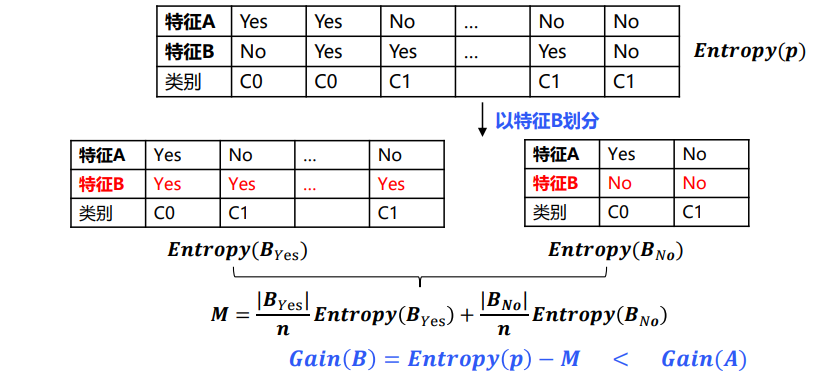
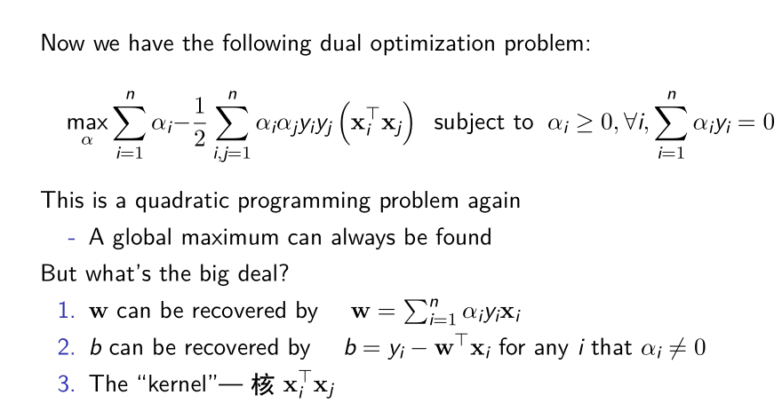
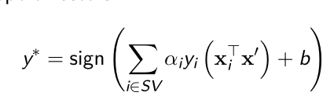

# Artificial Intelligence

## 1 Agents

定义一个问题的智能体：**Agents**

> An agent (智能体) is anything that can be viewed as perceiving its environment through sensors（传感器） and acting upon that environment through actuators（执行器）

定义：

**目标形式化**：到达目的地

**问题形式化：** **状态**：不同的城市，**动作**：城市路径的选择

**问题的解：**路径序列

一个问题形式化可以由四个组成部分来形式化：

1. **初始状态**（智能体一开始的初始状态）
2. **动作或后续函数**（智能体能够执行的动作，以及执行该动作后获得的代价）
3. **目标测试**（智能体对所在状态进行一个判断该状态是否为终止状态的操作）
4. **路径代价**（到达目标状态到时候，评价一下从初始状态经过的动作序列获取的总代价）

**智能体的问题都可以描述为**：

定义智能体的初始状态，找出智能体可以走的动作序列，然后进行执行，执行后得到的新状态，智能体对目前状态进行目标状态的测试。

- 如果不是目标状态，则将从初始状态达到该新状态的代价保存起来，继续重复寻找该新状态可以执行的动作。


- 如果是目标状态，则over，返回从初始状态到达该目标状态的总代价即可

## 2 Search

### 2.1 什么是搜索

搜索问题是指既不能通过数学建模解决，又没有其他算法可以套用或者非遍历所有情况才能得出正确结果。这时就需要采用搜索算法来解决问题。搜索就是一种通过穷举所有解的状态，来求得题目所要求的解或者最优解的方法。
搜索的基本概念：

1. 状态：对某一系统在某一时刻的数学描述。
2. 动作：从当前时刻状态转移到下一时刻所处状态的操作。
3. 状态转移：对某一时刻的状态进行动作后所达到的状态。
4. 路径：一个状态序列，该序列被一系列动作所连接。
5. 目标测试：评估当前状态是否是所求解的目标状态。

### 2.2 树搜索与图搜索

基本思想：通过扩展已探索状态的后继，离线模拟探索状态空间


**Main variations:**
▶ Which leaf node to expand next
▶ Whether to check for repeated states
▶ Data structures for frontier, expanded nodes

检测不到重复状态可能会将线性问题变成指数问题！

避免探索冗余路径的方法是牢记曾经走过的路。为了做到这一点，我们给TREE-SEARCH搜索树算法增加一个参数–这个数据结构称为探索集(也被称为 closed 表)，用它记录每个已扩展过的结点。

新生成的结点若与已经生成的某个结点相匹配的话–即是在探索集中或是边缘集中-那么它将被丢弃而不是被加入边缘集中。

### 2.3 搜索策略通过选择节点扩展的顺序来定义搜索策略

根据以下维度评估策略：   

- 完整性(完备性）: 如果存在，它是否总能找到解决方案？
- 时间复杂性(时间复杂度）: 生成的节点数
- 空间复杂性(空间复杂度） : 内存中的最大节点数
- 最优性(最优性）: 它总是找到成本最低的解决方案吗？

时间和空间复杂性是根据

- b： maximum branching factor of the search tree搜索树的最大分支因子—分支因子

- d： depth of the least-cost solution—最浅的目标节点的深度
- m： maximum depth of the state space状态空间的最大深度（可以是 ∞）—最大深度

### 2.4 Uninformed Search

**无信息的搜索：除了问题中提供的定义之外没有任何关于状态的附加信息**


### 2.4 Informed Search

- 有信息的搜索：在问题本身的定义之外还可利用问题的特定知识。
- 无论任何情况下，与无信息搜索策略相比，使用好的有信息的启发式搜索可以节省大量的时间和空间。
- 有信息搜索又叫做启发式搜索，顾名思意，这种搜索方法和启发式函数h(n)有着密切的关系。而h(n)就是有信息搜索的关键信息。这里的有信息指的是所求解问题之外的，但是与求解问题相关的特定信息或知识。

## 3. CSP

### 定义与算法

定义 CSP 问题的三要素

1. **variables**: $\lbrace X_1,...,X_n\rbrace$, 待赋予值的变量
2. **values**: $\lbrace D_1,...,D_n\rbrace$ , 每个变量可以选择的值域
3. **constrains**: $C_i(\lbrace X\rbrace)$ , 变量之间满足的约束关系

目的：在满足约束 **C** 的前提下，为所有 **X** 寻找合法的值

算法：**Backtracking**

```cpp
procedure backtrack(Path) is
    if reject(Path) then return
    if accept(Path) then output(Path)
    select_variable(var)
    for value in candidata_list(var)
		change(Path,var,value);
        backtrack(Path)
        recover(Path,var,value);
```

### 提高搜索效率的手段

#### Forward checking—前向检验

思想：提前终止、减少可选值的数目

在前向检验算法中，**首先选定一个变量，并根据该变量的取值进行搜索。在搜索过程中，如果发现某个未赋值的变量是否还有可取值，则回溯到前一个变量，并重新选择取值**。通过这种方式，可以逐步缩小搜索空间，提高搜索效率

#### 最少剩余值启发式

解决：下一步应该分配哪个变量

- Minimum remaining values 最少剩余值(MRV):选择合法值最少的变量
- 在MRV算法中，**首先遍历所有未赋值的变量，计算每个变量剩余可取值的个数，然后选择剩余可取值最少的变量进行赋值。如果发现某个变量的可取值为空，则回溯到前一个变量，并重新选择取值**。如果所有变量都已经赋值，则找到一个解，否则继续进行搜索

#### 度启发式

解决：下一步应该分配哪个变量

- 度启发式：通过选择与其他未赋值变量约束最多的变量来试图降低未来的分支因子
- 度启发式可以决定选择第一个着色区域
- 在度启发式算法中，**首先遍历所有未赋值的变量，计算每个变量与其他未赋值变量相连的边数，然后选择与其他未赋值变量相连边数最多的变量进行赋值。如果发现某个变量的可取值为空（提前检测），则回溯到前一个变量，并重新选择取值**。如果所有变量都已经赋值，则找到一个解，否则继续进行搜索。

#### 最少约束值启发式

解决：应该按照什么顺序尝试它的值

- 一旦一个变量被选定，算法需要决定检验它的取值顺序。有时最少约束值启发式很有效
- 它优先选择的值是给邻居变量留下更多的选择。
- 在每一次选择一个变量进行赋值时，优先选择对其他变量产生最少约束的取值，从而尽可能减少搜索空间，在LCV算法中，**首先遍历一个变量的所有可取值，计算每个取值对其他变量产生的约束值之和，然后选择约束值最小的取值进行赋值。如果发现某个变量的可取值为空（提前检测），则回溯到前一个变量，并重新选择取值**。如果所有变量都已经赋值，则找到一个解，否则继续进行搜索

#### Constraint propagation — 约束传播

前向检查将信息从已分配的变量传播到未分配的变量，但不能为所有故障提供早期检测

解决：当一个变量赋值后，为所有可选值域变化的变量进行约束检测，更早的结束不满足约束的情况

### 4. $\alpha-\beta$ 剪枝

- 己方是找 MAX 为目标

- $\alpha$ 是 MAX 的下确界，找 MAX 一般都是从 $\alpha = -\infty$ 开始找起，凡是比 $\alpha $ 大的，都将修改 $\alpha$ , 成为新的 $\alpha$ 值, 当然比 $\alpha$ 小的则保持 $\alpha$ 不变 ；$\beta$ 同理
- 只有在选择最大/最小时才会修改 $\alpha-\beta $
- 父节点 $\alpha-\beta$ 不受到子节点 $\alpha-\beta$ 的影响，唯一影响父节点的 $\alpha-\beta$ 值只有子节点本身的值
- 子节点会继承父节点的 $\alpha-\beta$ 值，并同样在比较节点值后进行修改，MAX方修改 $\alpha$,  MIN 方修改 $\beta$
- 节点要满足约束 $\alpha \le v\le \beta$ ,
- 当 $\alpha \ge \beta$ 时,则剪枝，因为 MIN-MAX 缘故，一旦对方找到的 $\beta\le \alpha $，则对方会毫不犹豫的选择该值，则会导致己方不再有机会能够选到 $\alpha$ 这个更大的值 
- 剪枝的精髓在于，当发现该节点根据子节点值顺序进行 Select 过程中，会不断比较修改 $\alpha$ 或 $\beta$ 的值，一旦出现不满足约束条件的情况时，就不用再遍历后面的子节点了，**因为这个节点本身不会被更高的节点所 Select**


代码：

```cPp
int alpha_beta(int u, int alph, int beta, bool is_max) {
  if (!son_num[u]) return val[u];
  if (is_max) {
    for (int i = 0; i < son_num[u]; ++i) {
      int d = son[u][i];
      alph = max(alph, alpha_beta(d, alph, beta, is_max ^ 1));
      if (alph >= beta) break;
    }
    return alph;
  } else {
    for (int i = 0; i < son_num[u]; ++i) {
      int d = son[u][i];
      beta = min(beta, alpha_beta(d, alph, beta, is_max ^ 1));
      if (alph >= beta) break;
    }
    return beta;
  }
}
```

## 4. 贝叶斯网络

### 频率学派

- 概率是事件发生的长期预期频率。
- P(A) = n/N，其中n是事件A在N次机会中发生的次数。
- "某事发生的概率是0.1"意味着0.1是在无穷多样本的极限条件下能够被观察到的比例。
- 在许多情况下，不可能进行重复实验:例如问题：第三次世界大战发生的概率是多少？

### 贝叶斯学派

- 概率是信念的度量。
- 它是一种基于不完全知识给出事件可能性的度量。
- 贝叶斯分析从先验信念开始，根据新的数据更新这种信念。
- 贝叶斯概率的主观性可能是一个限制，因为不同的人可能有不同的先验信念，并且可能根据相同的数据以不同的方式更新他们的信念

### 独立性/条件独立性

- 当且仅当 $P ( A \vert B ) = P ( A )$ ，或 $P (B|A ) = P ( B )$ ，或 $P(A,B)=P(A)P(B)$时，A和B是独立的。

- 如果 $P(A\vert B,C)=P(A\vert C)$，则在给定C的条件下，A对于B是条件独立的。

- 在大多数情况下，使用条件独立性可以将全联合概率的表示从指数关系减少为线性关系。

- 条件独立性是我们关于不确定环境最基本和最强大的知识形式。

- 它可以简化复杂模型和更有效地进行推断。


### Probability Theory（概率论）

概率论可以用两个简单的方程式表达:

- 加法规则（Sum Rule）: $P(X) = \sum_Y P(X,Y)$，通过边缘化或求和其他变量来获得变量的概率。

- 乘法规则（Product Rule）:  $P(X,Y) = P(X|Y)P(Y)$ ，联合概率可以用条件概率表达。

- 贝叶斯公式：

  $$
  P(Y|X)=\frac{P(X|Y)P(Y)}{P(X)}
  $$
  
  其中 $P(Y)$ 是先验概率，$P(Y\vert X)$ 是后验概率，其表达的是在已知 $X$ 的条件下对 $Y$ 概率预测的修正

所有的概率推断和学习都可以归结为不断应用加法规则和乘法规则。

### 贝叶斯网络

贝叶斯网络是一种简单的、图形化的数据结构，用于表示变量之间的依赖关系（条件独立性），为任何全联合概率分布提供一种简明的规范。

- 一个节点对应一个变量。
- 一个有向无环图（DAG）（链接 $\approx$ “直接影响”）。
- 每个节点都有一个条件分布，给定其父节点的条件下的概率分布： $P(X_i∣Parents(X_i))$，量化其父节点对该节点的影响

#### 枚举推理


### 朴素贝叶斯模型


#### 例如：邮件分类


## 5 机器学习

### 最小二乘法


### 决策树

基本的决策树学习过程，可以归纳为以下三个步骤：

1. 特征选择：选取对于训练数据有着较强区分能力的特征
2. 生成决策树：基于选定的特征，逐步生成完整的决策树
3. 决策树剪枝：简化部分枝干，避免过拟合因素影响

信息熵：计算数据的不确定性


$$
\text{Entropy}(Y|X)=-\sum_{i=1}^m p(x_i)\text{Entropy}(Y|X=x_i)
$$

#### 特征选择准则一：信息增益

$$
Gain(X)=Entropy(Y)−\text{Entropy}(Y|X)
$$




#### 特征选择准则二：信息增益率

$$
\frac{Gain(X)}{-\sum_{i=1}^m p(x_i)\log_2p(x_i)}
$$

#### 过拟合与剪枝

#### 预剪枝

在决策树生长过程中，对每个结点在划分前进行估计，若当前结点的划分不能带来决策树泛化性能的提升，则停止划分并将当前结点标记为叶结点。

在构建决策树过程中，将其标记为叶结点，类别标记为训练样例中最多的类别，与划分前后验证集命中率进行比较，决定是否剪枝

#### 后剪枝

先从训练集生成一颗完整的决策树，然后自底向上地对非叶结点进行考察，若将该结点对应的子树替换为叶结点能带来决策树泛化性能的提升，则将该子树替换为叶结点。

在完整的决策树上进行剪枝，从下往上，判断剪枝前后命中率

### SVM

**研究起因**：如何找到最优的切分面 

- 概率的角度，就是使得置信度最小的点置信度最大
- 即使我们在选边界的时候犯了小错误，使得边界有偏移，仍然有很大概率保证可以正
   确分类绝大多数样本，因为边界只与极少数的样本点有关

优化目标
$$
\max_{w,b}\min_{i}\frac{\vert w^Tx_i+b\vert}{\vert{w}\vert}
$$
问题转化


对偶问题





#### kernel 方法


### 聚类算法


